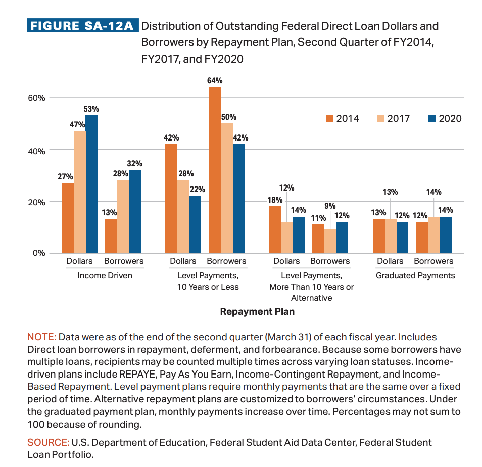
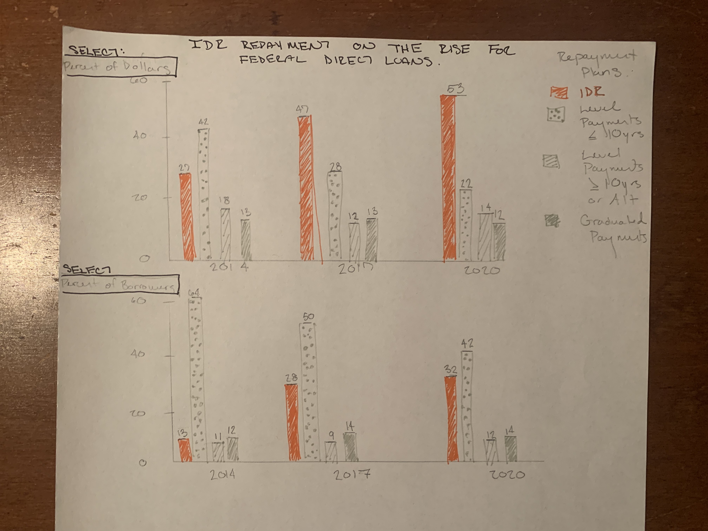
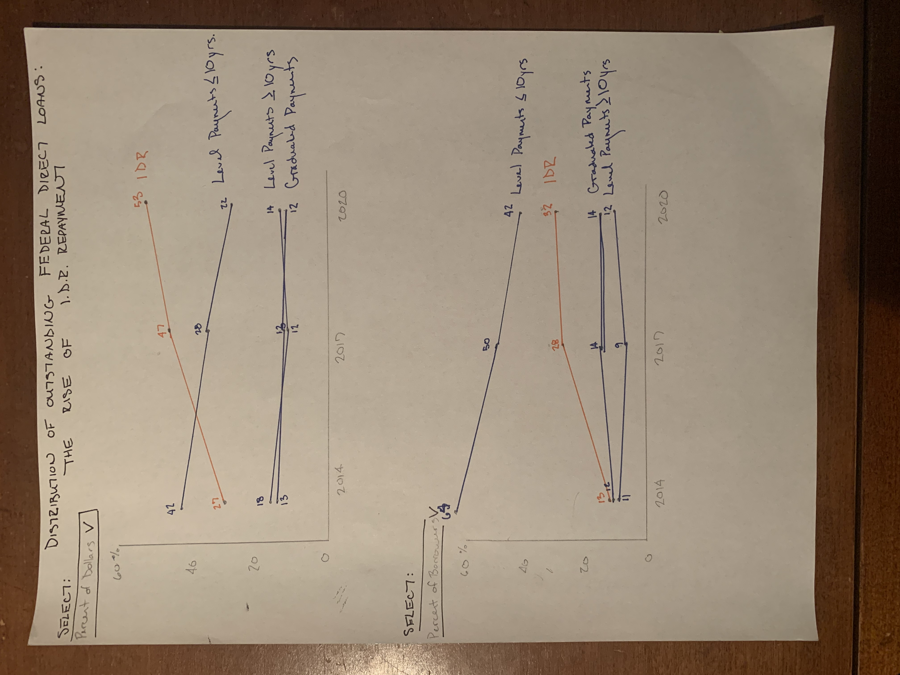

# Critique by Design

This assignment will cover six steps for selecting, critiquing, and redesigning a data visualization.  

## Step one: Select a data visualization 

For this exercise, I wanted to work with a visualization that considered student loan debt and repayment options, which is a policy research topic I recently engaged with in another Heinz course.  While researching student loans, I learned about income-driven repayment (IDR) plans. An income-driven repayment plan sets a borrower's monthly student loan payment at an amount that is intended to be affordable based on your income and family size. There are multiple IDR options available to borrowers, which offer set timelines for repayment using fixed amounts— most often 10% income. Borrowers pay that percentage of earnings monthly until the timeline is up, when the remining balance is forgiven. 

I selected this visual from "Trends in College Pricing and Student Aid 2020" authored by research scientists at College Board. As a reader, I found the visual was difficult to read and had the potential to make a stronger point about IDR, which was highlighted in the subtitle but not the data visualization. This visualization shows how outstanding student loan debt has been shared across repayment plan selection at three points in recent history- 2017, 2017, and 2020. The distribution is quantified in the percentage of total dollars as well as the percentage of total borrowers. For each year of interest, both of these measures should total 100%. 

 

The visualization can be found on page 40 of the report, linked here: https://research.collegeboard.org/pdf/trends-college-pricing-student-aid-2020.pdf

## Step two: Critique the visualization

Overall, this data visualization has included two different, but complimentary, sets of information by representing the repayment plan variable using percent of dollars and percent of borrowers. While these can use the same scale, it does not help with perceptibility to have the different data alternating on the x-axis. At that, it is not clear that the visualization is supporting the educational goal of this section of the report, which is subtitled, “more than half of the debt owed by student loan borrowers in repayment is now in Income-Driven Repayment (IDR) plans that limit monthly payments to a share of income.”

I am interested in larger reformatting that splits the dollars and percentages into two different graphs. These graphs could be stacked or parallel in another way, that does not require the reader to flip back and forth in one visual. At that, I would be interested in seeing groupings by year, with the loan repayment as the colored variable and year on the axis. If possible, I may try to create a selection feature. In wireframing, I may try a few different assignments of variables to parts of the chart. I also would like to work on alignment, text, and using color to highlight IDR plans as indicated in the subtitle. I will try to be consistent with the College Board colors of orange and blue, but try to have less strong contrasts as the initial visualization. 

## Step three: Wireframe a solution

The main goal of my wireframes was to separate the distribution by the percentage of dollars and the percentage of borrowers into two distinct visualizations that could be presented togather. I was interested in using the years to show sequence, instead of as a categorical component. My first wireframe more more similar to the origional visualization because I decided to keep the bar chart layout. For the second wireframe, I created a line chart because I was interested on more explicitly demonstrating the change over time. In both of these layouts, you will see that IDR is on the rise, while other, more traditional repayment models are decreasing or remaining steady for percent  of dollars and borrowers. 

### Wireframe 1: Bars

### Wireframe 2: Lines 

## Step four: Test the solution

To test the solution I conducted interviews with three friends who are also students at Heinz. To respect their identities, I have called my friends A, B, and C. With each friend, I shared the wireframes and explained that the bar and line chart included the same data and each had a mock-drop down menu. I did not offer any explanation of the charts. I gave them each a few minutes to read. 

### Questions and Answers:  

*Can you tell me what you think this is?*

A: Thinks that these are the 4 main options for repaying education loans.  I think it is two graphs- one showing the percent of dollars for a payment type out of the total federal direct loan payments in the US. It shows that IDR grew from 27% to 53% in the six years included. I like the orange- easy to see what you’re highlighting here. It seems to have mostly grown while the level of payments has decreased and the other two are decreasing. It seems to track with the borrowers. This seems clear. 

B: “What does IDR stand for?” I am looking at the percent of total dollars attributed to each form of repayment in a given year. The second is the percent distribution of the types of borrowers for each kind of repayment. 

C: Are you comparing IDR to the others? If so, then it’s working. If it’s not the goal then you need to change the colors. I think this is comparing the effects of different loan repayments over time- looking at the borrowers and department of education revenue stuff. 

*Which of the charts do you prefer? Why? Is one of them easier to read?*

A: I like the line chart more than the bar chart. The bar chart communicates the same information, but the line chart shows more clearly how things change over time. A linear representation is easier and doesn’t feel like it needs to be broken down any further. 

B: I think the bar chart is easier to read. Visually, you can see the differences easier in types of repayment plans across years. Within and across is easier to see for me. Obviously, you can see in the line also. But the scale is easier with the bar. You can see more easily with the bar how IDR compares across the year. This works better for my brain. 

C: I think if you’re spending a short amount of time, initially the bar chart is easier to read. But I think this is  a bias because you see more bar charts. But I think the line chart has a value of being a better representation of data. If you have more time, I like the line chart better. 

*Is there anything you find surprising or confusing (about the layout)?*

A: No. 

B: Not really. The only thing I would say is when I see lines vs bars, I see continuous. Since we are looking at 3 distinct moments in time, I like the bar chart more. The slope is useful, but then I don’t see it as a distinct point. Does this change the meaning of the data? Is it a fair representation? 

C: No. 

*Who do you think is the intended audience for this?*

A: I’m not sure how useful it would be to a loan borrower. I think it would be more useful in conjunction with some more information on how effective these options are for people. In that regard, I think some of the audience would probably be policymakers who would see these increases/decreases and then be moved to consider why. It could push a policymaker to think, "are these options working for people?" What would a policy maker need to change so that the better options are reaching more people? 

B: Maybe policymakers that are looking to try and get a handle on student loan repayment and looking at what to attack first. 

C: I would guess it is a government decision maker. 

*Is there anything you would change or do differently?*

A: It’s pretty clear. As myself, I needed to ask, "What does IDR stand for? What is a level payment?" Granted, if you are a policymaker, you would probably know what these things are. As someone with loans, a refresher would be nice. 

B: I don’t think so. I feel like especially with the bar chart, it just does a good job of what it is trying to do. If I interpreted correctly what I think it’s trying to do. I’m also assuming that whoever is looking at this has additional context or already knows what each type of repayment plan means. I’m not sure how much that specifically matters, but knowing what IDR vs. graduated vs. level might make the information more meaningful. Is IDR growing good or bad? 

C: “IDR Repayment” in the title is redundant. As someone who doesn’t know and had to ask what IDR means and doesn’t have a lot of loan knowledge, I would appreciate an accompanying few sentences blurb on the side or bottom explaining what the 4 options are. This doesn’t mean anything to me if I don’t know. But this is about who your intended audience is- whether or not it would be superfluous or not.

### Patterns and Implementing: 

Patterns that emerged in the feedback were: 
1. For the visualization to have value, the intended audience would need pre-existing knowedge on federal student debt replayment plans or more explanation 
2. Using familiar chart layouts has removed surprise or confusion
3. The line chart may be misleading because contunous data is not being used 

Based on this feedback, as I build new visualizaitons, I will not use the line chart. The observation that a line chart is better for a continuous variable was shocking because I had not considered this potential visualization weakness that the line could be misleading and might even impact the "truthfulness" score Data Visualization Effectiveness Profile. I will continue with bar charts in the next phase and will refine my titles.  

I was not shocked to hear that my friends expected the audience to be policymakers because I had made the decision to not include additional educational information or context to the visual, which is consistent with the design by the research scientists at College Board. I think that the intended audience of this visual is policy writers, journalists, or other researchers interested in the question of college loan debt and repayment plans. It was valuable to know, however, what changes could be made to suit a general audience. 

## Step five: Build your solution

I first decided to use Tableau build my solutions, which led to some software and technical challenges. To recreate the visualization, I created small datasets that represnted the values for the dollars and borrowers. Separating this data into two sets was an early mistake that required me to join sheets inside Tableau using a basic understanding of relational databases. As such, I was not able to create the drop down menu from my Wireframe. While building these solutions, I applied the feedback by creating better titles and labels and using the bar format. 

I created stacked and grid versions of column charts for the percentages of dollars and percentages of borrowers variables. Unsure of which was better, I hoped to present both options in the in-class demo and gain additional feedback. 

### Stacked Column Chart- Borrowers

<noscript></noscript><object class='tableauViz'  style='display:none;'><param name='host_url' value='https%3A%2F%2Fpublic.tableau.com%2F' /> <param name='embed_code_version' value='3' /> <param name='site_root' value='' /><param name='name' value='IDR_RepaymentPlans&#47;Tall_Borrowers' /><param name='tabs' value='no' /><param name='toolbar' value='yes' /><param name='static_image' value='https:&#47;&#47;public.tableau.com&#47;static&#47;images&#47;ID&#47;IDR_RepaymentPlans&#47;Tall_Borrowers&#47;1.png' /> <param name='animate_transition' value='yes' /><param name='display_static_image' value='yes' /><param name='display_spinner' value='yes' /><param name='display_overlay' value='yes' /><param name='display_count' value='yes' /><param name='language' value='en-US' /></object>

### Stacked Column Chart- Dollars

<noscript></noscript><object class='tableauViz'  style='display:none;'><param name='host_url' value='https%3A%2F%2Fpublic.tableau.com%2F' /> <param name='embed_code_version' value='3' /> <param name='site_root' value='' /><param name='name' value='IDR_RepaymentPlans2&#47;Tall_Dollars' /><param name='tabs' value='no' /><param name='toolbar' value='yes' /><param name='static_image' value='https:&#47;&#47;public.tableau.com&#47;static&#47;images&#47;ID&#47;IDR_RepaymentPlans2&#47;Tall_Dollars&#47;1.png' /> <param name='animate_transition' value='yes' /><param name='display_static_image' value='yes' /><param name='display_spinner' value='yes' /><param name='display_overlay' value='yes' /><param name='display_count' value='yes' /><param name='language' value='en-US' /><param name='filter' value='publish=yes' /></object>

### Column Chart with Grid- Borrowers 

<noscript></noscript><object class='tableauViz'  style='display:none;'><param name='host_url' value='https%3A%2F%2Fpublic.tableau.com%2F' /> <param name='embed_code_version' value='3' /> <param name='site_root' value='' /><param name='name' value='IDR_RepaymentPlans4&#47;Long_Borrowers' /><param name='tabs' value='no' /><param name='toolbar' value='yes' /><param name='static_image' value='https:&#47;&#47;public.tableau.com&#47;static&#47;images&#47;ID&#47;IDR_RepaymentPlans4&#47;Long_Borrowers&#47;1.png' /> <param name='animate_transition' value='yes' /><param name='display_static_image' value='yes' /><param name='display_spinner' value='yes' /><param name='display_overlay' value='yes' /><param name='display_count' value='yes' /><param name='language' value='en-US' /><param name='filter' value='publish=yes' /></object>

### Column Chart with Grid- Dollars  

<noscript></noscript><object class='tableauViz'  style='display:none;'><param name='host_url' value='https%3A%2F%2Fpublic.tableau.com%2F' /> <param name='embed_code_version' value='3' /> <param name='site_root' value='' /><param name='name' value='IDR_RepaymentPlans3&#47;Long_Dollars' /><param name='tabs' value='no' /><param name='toolbar' value='yes' /><param name='static_image' value='https:&#47;&#47;public.tableau.com&#47;static&#47;images&#47;ID&#47;IDR_RepaymentPlans3&#47;Long_Dollars&#47;1.png' /> <param name='animate_transition' value='yes' /><param name='display_static_image' value='yes' /><param name='display_spinner' value='yes' /><param name='display_overlay' value='yes' /><param name='display_count' value='yes' /><param name='language' value='en-US' /><param name='filter' value='publish=yes' /></object>
                

## Step six: Classroom feedback and iterate 

During the in-class presentation, my peers were divided on if they liked the stacked or grid layout better. I received the following suggestions:

1. Considering adding a subtitle 
2. Consider if the gradient of secondary colors is helpful, or if they can all be the same 
3. Keep units on the axis and in the bar labels consistent 
4. Organize time from left to right (or top to bottom) 
5. Remove legends and labels that are redundant 

Based on these tips, I again reformatted my data into a single sheet and loaded it to Flourish. In Flourish, it was easier to create one, interactive visualization that allowed a user to switch between considering how the distribution of loan repayment could be broken down into the percentage of dollars or borrowers associated with each option. I did not select to have one color blue for the three repayment options besides IDR because a researcher could be interested in which of these plans decreased, as borrowers (and the dollars associated with a borrower) shifted toward IDR plans. I added a subtitle and kept constant units.   

