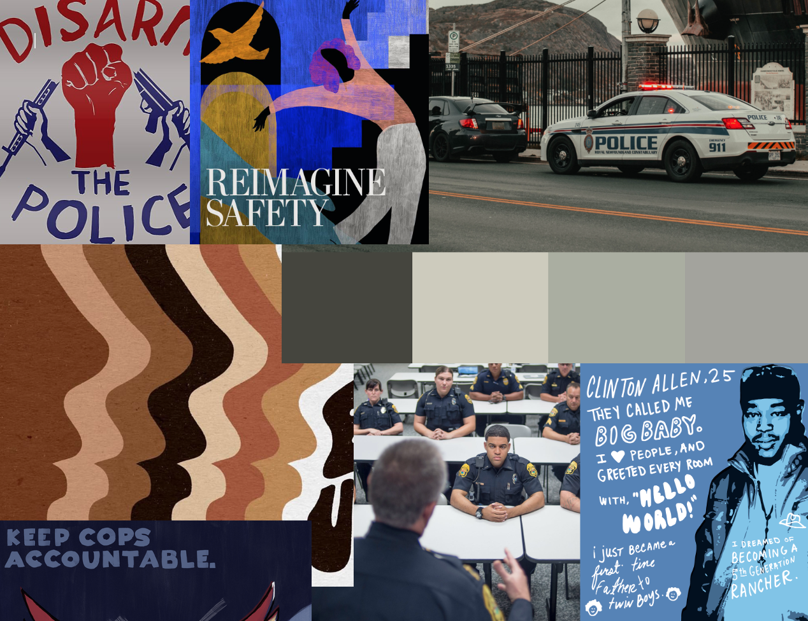

# Final Project Part Two

## Wireframe
Link:
[wireframe](https://preview.shorthand.com/xfhyxjoPEP5muTNL)

<iframe
  src="https://preview.shorthand.com/xfhyxjoPEP5muTNL"
  style="width:100%; height:300px;"
></iframe>

## User Research & Interviews

Goals of the  user research protocol should clearly identify the following:

a. the target audience you hope to reach with your story; b. your approach to identifying representative individuals to interview; c. your interview script; d. the findings from your interviews; and e. changes you plan on implementing to your visualizations next week to address the issues identified.

### Target Audience 

The audience I hope to reach includes any residents of the US who have been drivers or passengers of private vehicle. Traffic stops impact a wide section of people and I will plan to reach individuals of different ages, geographic locations, and political beliefs. The goal of my project is to educate the target audience on the current policing training and practices that surround traffic stops. The call to action is segmented into three levels- each level that has a more dramatic pogram or policy response. If given a longer research timeframe, I would be interested in identifying individuals who live in highly-policed communities as well as individuals who work in law enforcement. 

### Approach to identifying representative individuals to interview

With hopes of reaching out to this target audience, I contacted individuals who are licensed to drive in the United States. I tried to recruit individuals with differing ages and political beliefs. I reached out to family and friends fit these criteria. The information that I wanted to collect on my interview subjects were the following:

### Interview Script 

My goal is to collect feedback on my Telling Stories with Data project, which was motivated by a New York Times podcast about traffic stops. My goal will be to get your input on the flow of the narrative, the design and data visualizations, and if the call to action logically follows the path of the story. 

#### Narrative Flow 

1. Does the story progress in a logical way? Would you reorder any of the sections? 
2. Are there any questions that you still have at the end?

#### Design and Data Visualization 

1. Are the data visualizations clear? If not, what would you change? 
2. Is there anything you find surprising or confusing (about the layout of the charts)?
3. What do you think about the use of color and images? Are they helpful or distracting? 

#### Calls to Action 

1. Who do you think is the intended audience for this?
2. Do the calls to action flow logically from the story? What could be added or changed to inspire action? 
3. What other suggestions or feedback to you have? 

### Interview Findings 

The findings of my interview are summarized in the table below: 

Person A: 27 year old/ female/ suburban driver/ progressive / student
Person B: 33 years old / female / urban area driver / progressive /student 
Person C: 60 years old / male / "cautious" suburban driver / conservative /engineer 

Narrative Flow 

| Syntax      | Description |   Description |    Text     |  
| :---        |    :----:   |      :----:   |        ---: |
| Header      | Title       |  Title        | Here's this   |
| Paragraph   | Text        | And more      | And more      | 

1. Does the story progress in a logical way? Would you reorder any of the sections? 
Jen: Would not re-order anything. 
Lori: I think your story progressed pretty well. It felt like you started with a high-level hook and dove into a breakdown of different motorist police interactions. Then the disparity across race and training issues. It made sense to me. The content felt well-flushed out. At the end, to reduce violent and fatal traffic encounters feels different. It feels like a jump for how police are operating and flowing into this. Add a subheading after the survey data. 
Kevin: It flowed fine. Has a question on what is included in risk to the police- can that be defined more? So what is the basic point? I don't know what the topic is becuase what you are really saying is... you're saying current data support problems with traffic stops- I did not grasp what it was about in the initial paragraph. You talk about traffic stops being dangerous, but the real essence to the website is not well-explained. 

2. Are there any questions that you still have at the end or information you feel is missing?
Jen: I don't think so. But, I'm just back at the beginning becuase looking at the bar graph looking at traffic stops resulting in noncompliance. I didn't get the title. I didn't get what noncompliance meant. If I didn't have you walking me through it, I would still be confunsed. So I had that question earlier.  
Lori: Not missing, but there were a couple of graphs where I had trouble trying to interact with the scores map. I got pulled away from the US in the map- which took some time but is a software issue. I skipped over/missed the line about lower scores. My eye went right to the map. 
Kevin: The grey and the grey lines, I can't tell the difference.

Design and Data Visualization 

1. Are the data visualizations clear? If not, what would you change? 
Jen: In terms of what I would change- I think the title can help. This is saying "what do the police perceive are most likely to result in non-compliant or is this what happens." So, I would try to find away to make the title more clear that this is what police are saying. What they think is non-compliance. Could you just explain what the dataset is? You could change the title? Or add an X-title. I do think I like this survey part of the data because I think it's good to point out the pretextual stops. Since you are talking in the beginning about police preceptions and things that are happening, because this is what police define as non-compliance. It's all related to their concpetion- so keep it here. The tableau map is cool. 
Lori: The only time I stopped and paused was the "frequency of training" just because there are so few of every shift and weekly. Maybe this could be displayed so that those sections are easier to read. The survey question above it has higher frequency, so it is easier to visualize. It is also similar with the percent of residents who experince non-fatal threats, but those small bands are maybe at a better place to seem- but stacking makes sense. Changing standalone bar charts could be less clear. The 2015 to 2018 is interesting, but is the point to depict the change? It hasn't increased by much- is that the point? (clarify in comparison to other lines) I tihnk maybe if you change the title from "comparison" to "Police-initiated vs...." or "Police-initiated constantly high." Take the date out the title would help. 
Kevin:  The only thing that has changed is that residents call the cops more. I don't think that this is helpful. Was this red line in the same place ten years prior? 

2. Is there anything you find surprising or confusing (about the layout of the charts)?
Jen: That title for the first bar chart. 
Lori: Not really. I think you did a good job. I found a couple of typos- in the first sentency "recently", in the second paragraph dropped the work "York". Can you get the numbers to run where you scroll there?
Kevin: Need to be more explicit about the first barchart about the types of non-complaince- it needs a better label. I can see that it adds up to a 100%, these stacked ones. 

3. What do you think about the use of color and images? Are they helpful or distracting? 
Jen: On the line chart- the lines being slightly different makes me think I should look at them. I understand that because we are talking about traffic stops- but I didn't find this intuitive in the beginning. I like the color skeme in general. You avoiding problems for red-green colorblindness. The images are good- they are not distracting and are relevant to the sections and work to break up the text. 
Lori: I felt the gray on white for the axis on the labels is a bit hard to read on some of the charts. Maybe easier for an older reader. I really like that you used images and headers over them to break up the sections of the narrative. This worked nicely and I clocked it while I was reading it. It helped break it up into digestable pieces and helped the flow a lot. It would have been more disjointed without the breakpoints. The colors are pretty classic- easy to see and read, not too bright or dark. A safe go-to. Maybe try to make the labels and axis a bit darker. When you are stacking, having distinct colors helps to isolate- especially with the bars that have a small band. Is that how you can make the frequency of stop stand out more? I want to see this lacking more obviously- how much more narrow they are. But the consistent way of visualizing the data is helpful- especially if someone is not used to looking at data- it could be easier.  
Kevin: The layout on the phone isn't great. 

Calls to Action 

1. Who do you think is the intended audience for this?
Jen: This is probably a general audience- I could see it being intended as a news audience. It's pretty accessible. I don't think it assumes a level of knowedge or educaiton- maybe general consumers of news. 
Lori: People who make police trainings. People who are trying to reform- it could be police unions? People who are trying to change the systen- whether that is everyday constiuents speaking to their represetntatives or advocates or policy makers. I think it could be a wide range. 
Kevin: Your professor. Local politicans and police departments. People who would be in charge of training or defining what police departments need to do. 

2. Do the calls to action flow logically from the story? Are the "active" enough calls to action? 
Jen: I think they flow and that they pull out something that you already talked about. You talked about training and pretextual stops and those experiences- so that is founded in something you talked about. I do see that it's a more call to action for policy makers or police agencies themselves. So, I could see a reader wanting a more direction action/petition/write to your legislature. That may fit the audience better. 
Lori: It looks kinda like further readings. It's useful. But, you could add a more active call by (after doing the readings) to figure out what the next step is. Who are you calling now? This might depend on who the audience is. With the local-level of police, it would be hard for a broad call to action- you would need to insert a zip code. 
Kevin: If I was interested, I would click the link. It's clear. 

3. What other suggestions or feedback do you have? 
Jen: I like this a lot. One thing that I think about a lot when I think about police things is language- so I wondered about "unnecessary violence" I am someone who thinks all violence is unnecessary. I am also hyperaware of language. 
Lori: Could you visualize the change in the final section about the Virginia? You could have 10 people and then 6/7 people. These people aren't being stopped by police- but it is a little fluff? But it would be good to call out the line, since the effects of the changes feels worth it. A way to make that stand out a bit more. 
Kevin: I still don't like the title. How about "Ways to help police at work." What about "Minimizing Violence in US Traffic Stops," this would have helped me know what she is going to talk about better.  

## Changes Based on Interview 

## Moodboards

